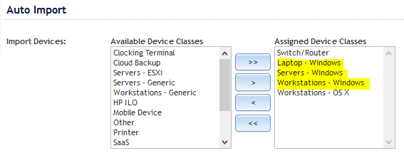
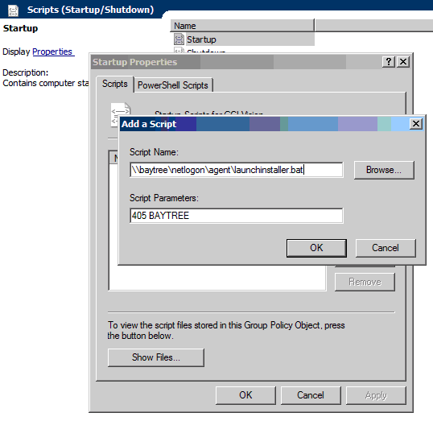
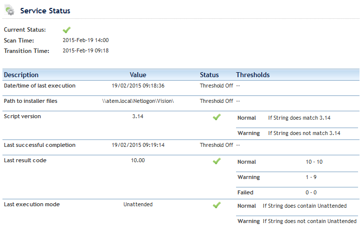

InstallAgent
============

This script is intended as a replacement for the stock N-central group
policy installer script as provided by N-able. It is not supported by
N-able, so please do not contact their support department regarding any
problems or questions about this script. In addition, it is not
supported by GCI Managed IT.

The script provides:

-   Automatic installation of Microsoft .NET4 and Windows Imaging
    Components on devices that do not have it installed

-   Automatic installation of the N-able agent

-   Detection of broken agents and automatic remove-and-reinstall

-   Self-healing on agent services

-   Very verbose logging into the Application event log

-   Customisable for your environment

-   Interactive (double click) mode

However, if you find a problem with the script or have ideas on how it
could be improved I would love to hear from you so please drop me a line
at tim.wiser@gcicom.net and I’ll be happy to help you out.
Alternatively, pop a post on the NRC discussion forum.

If you use this in your environment I’d love to hear from you!

***Disclaimer: This script is provided in good faith and must be tested
in your own environment before wide-scale deployment***

Configure the script for your own use
=====================================

The script as provided from myself is set up to work with the v9.5.1.451
agent. It will not function with agents that use .NET 2 and if you are
using a .NET 4 agent that is not v9.5.1.451 you will need to amend the
script to recognise that version.

1.  Open INSTALLAGENT.VBS using a text editor (I recommend Notepad++ as
    that’s what it was written using, and other editors may not handle
    the tabulation in the same way)

2.  Amend the line starting *CONST strServerAddress* to contain the FQDN
    of your N-central server

3.  Amend the line starting *CONST strBranding* to be the name of your
    company

Additional configuration can be carried out in the same section:

Value | Default | Purpose
----- | ------- | -------
*strPingAddress* | 8.8.8.8 | This address is pinged at the start of the script to see whether or not the device has Internet access.
*strSOAgentEXE* | SOAgentSetup.exe | This is the name of the SO-level agent installer file.
*strContactAdmin* | Please contact your IT administrator, support company or managed service provider to report this problem. | A message that appears when a critical error appears. You may want to change this into your local language.
*strAgentFolder* | Agent | The name of the folder where you store the GPO files. *NOTE: If you modify this you will also need to modify the path in the LaunchInstaller.bat file manually*
*strBranding* | N-able Agent | Change this to ‘brand’ the script. For example, you might change it to be the name of your company.
*intPingTolerance* | 20 | Percentage value of dropped packets before the Connectivity test is deemed to fail
*intPingTestCount* | 10 | The number of pings performed by the Connectivity test.

Configure N-central for automatic device import
===============================================

As default, if a device gets the agent installed it will still need to
be manually imported into the All Devices view of N-central. This can be
automated so that devices appear in the view without any manual
intervention.

To do this, perform the following change in N-central:

1.  Go to your SO level

2.  Click *Administration -&gt; Discovery Defaults*

3.  Ensure that *Workstations – Windows, Laptops – Windows* and *Servers
    – Windows* are all in the Auto-Import section (see below)

4.  Click *Save*

Set up the script files on your network
=======================================

These steps assume that you are using the defaults given in the table
above. If you have amended any of the CONST values, remember to use your
own values in these steps.

1. On a domain controller, open the NETLOGON folder and create a folder called AGENT

2. Copy INSTALLAGENT.VBS and LAUNCHINSTALLER.BAT into the AGENT folder

3. In N-central, go to the SO level and click the DOWNLOAD AGENT/PROBE SOFTWARE link

4. Download the WINDOWS AGENT file into the AGENT folder, renaming it as SOAGENTSETUP.EXE

5. Download the .NET FRAMEWORK 4 – X64 file into the AGENT folder, leaving the filename unchanged

6. Download the Windows Imaging Component files, *wic\_x64\_enu.exe,* and *wic\_x86\_enu.exe,* from https://www.microsoft.com/en-us/download/details.aspx?id=1385 into the AGENT folder
 
7. Copy the AGENTCLEANUP4.EXE utility into the AGENT folder

You should now have a folder called AGENT that contains:

-   INSTALLAGENT.VBS

-   LAUNCHINSTALLER.BAT

-   DOTNET40\_FULL\_X86\_X64.EXE

-   SOAGENTSETUP.EXE

-   WIC\_X64\_ENU.EXE

-   WIC\_X32\_ENU.EXE

-   AGENTCLEANUP4.EXE

Create the Group Policy Object on your network
==============================================

1.  Create a new GPO and link to a suitable OU or to the domain itself

2.  Expand the COMPUTER CONFIGURATION section and navigate through to
    SCRIPTS

3.  Create a new STARTUP script. The command to run is
    *\\\\DOMAIN\\NETLOGON\\AGENT\\LAUNCHINSTALLER.BAT* and the
    parameters field should *be XXX DOMAINNAME STARTUP*, where XXX is
    the numerical customer ID code in N-central and DOMAINNAME is the
    Active Directory domain name. For example, 405 BAYTREE STARTUP

Congratulations! Your installation is now complete.

Testing and troubleshooting
===========================

To test the script you can either run it in an admin command prompt or
double click on it from the AGENT folder. If you double click it, it
will run in a special interactive mode. If you run it in a command
prompt it runs in a hands-free mode.

*CSCRIPT*
[*\\\\DOMAIN\\NETLOGON\\AGENT\\INSTALLAGENT.VBS*](file:///\\DOMAIN\NETLOGON\INSTALLAGENT.VBS)
*/site:XXX /mode:STARTUP*

-   On a device that doesn’t have the agent or .NET 4 installed, the
    script will install .NET and then install the agent. If the Windows
    Imaging Components software (a pre-req for .NET 4) is not installed,
    this is installed for you.

-   On a device that has .NET 4 installed but no agent, the script will
    install the agent.

-   On a device that has a version of the agent older than v8, it will
    uninstall the old agent and install the new one.

-   On a device that has a broken or unresponsive agent, it will
    forcibly reinstall the agent. This can take about five minutes
    to complete.

-   On a device that has been deleted from N-central, the agent will be
    reinstalled and begin checking into N-central shortly after the
    reinstall has completed

The script logs its progress into the Application event log under source
*WSH* (Windows Scripting Host). It’s very verbose and the log is a great
place to look when you’re trying to find out why a device hasn’t
installed the agent.

Excluding devices
=================

It’s not always desirable to install the agent on every single device.
For example, you may have a customer that has EPOS tills that although
are joined to the domain, they do not require management. There’s a
couple of ways you can do this. Best Microsoft practice would be to
create a domain group containing the computer objects for the devices
and setting a Deny on the ACL for the Group Policy Object that runs the
script. Another way is to double click on INSTALLAGENT.VBS and respond
YES to the first question. Once you’ve done that, the script will still
run on the device but it will exit immediately, doing nothing.

Exit codes
==========

On a normal execution, the script exits with a code of 10. This is to
remove any ambiguity that might arise from an accidental code of 0 being
returned for any reason. The following codes can also be returned. These
exit codes are written into the Application event log when the script
finishes running and can also be found in the custom service.

> 0 Internal error
>
> 1 NET4 not installed / Windows 2000 detected / Windows XP not at SP3
> level
>
> 2 No external network access detected
>
> 3 Install source is missing / wrong version
>
> 4 Failure to install .NET4
>
> 5 Failure to install agent
>
> 6 Risk of downgraded/Zombie agent detected
>
> 7 Reserved for future use
>
> 8 Reserved for future use
>
> 9 Reserved for future use
>
> 10 Normal execution

Routine maintenance
===================

When you upgrade your N-central you will need to update the script and
installer file to recognise the new version of the agent.

1.  Locate the line beginning *CONST strRequiredAgent* and set it to be
    the version of the agent that you wish to use

2.  Update the SOAGENTSETUP.EXE file inside the AGENT folder

3.  Right-click over the SOAGENTSETUP.EXE file and select *Details*.
    Make a note of the *File Version* and set the line beginning with
    *CONST strAgentFileVersion* to match it

Tip! There are a number of partners on the NRC discussion forum who have
implemented Automation Policies or scripts that are designed to ease
this task, so I strongly recommend that you grab the most suitable one
for your needs.

Custom service
==============

When the script executes, it writes its progress into the Registry. This
information can be gathered and reported on within N-central itself so
you can see how your devices are behaving with the script. The custom
service, called *Agent Installer Script Status*, can only be used on 9.5
SP1 onwards.

Credits
=======

Thanks go to Pat Albert of N-able for development of the
AGENTCLEANUP4.EXE utility and to everyone on the N-able forums who has
helped and contributed ideas to this script.
